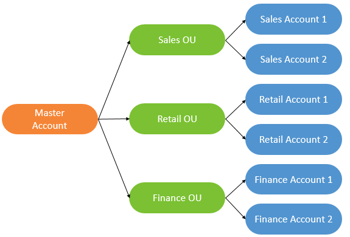
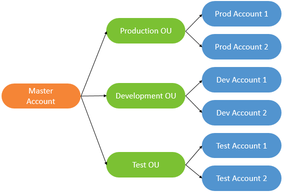
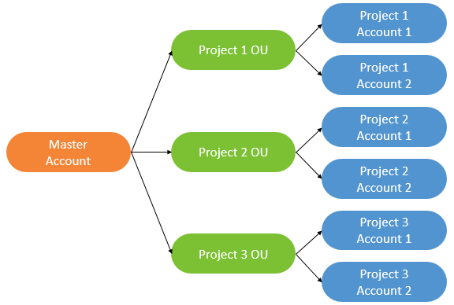
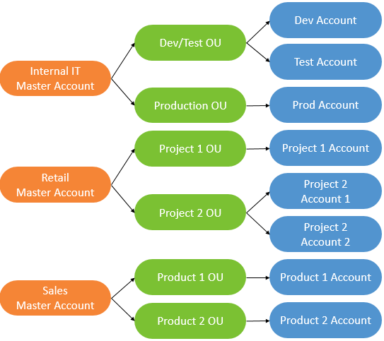
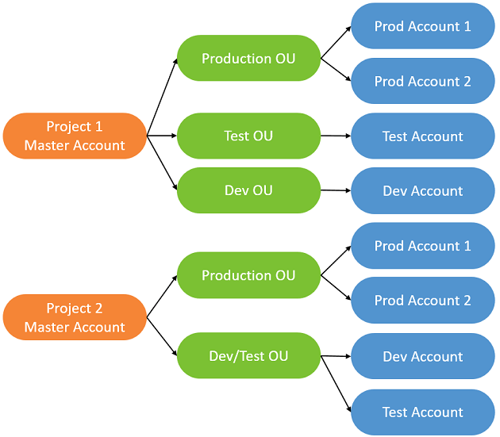

AWS Account Management Document
==============================================================================

Decide Your Organization Account Structure
------------------------------------------------------------------------------

Choose one from:

- Business Unit (BU) Account Structure

- Environmental Lifecycle Account Structure

- Project-Based Account Structure

Or:

- Hybrid AWS Account Structures

You can use the following criterion to make decision:

- If you are start up company and your engineer team having 10 - 50 employees, usually Project-Based Account Structure is the best choice.
- If you are mass enterprise having 500+ engineers, usually Business Unit (BU) Account Structure is the best option.
- If you are in the mid of these two case, Hybird AWS Account structure may fits you best.

Reference:

- AWS Multiple Account Billing Strategy: https://aws.amazon.com/answers/account-management/aws-multi-account-billing-strategy/
